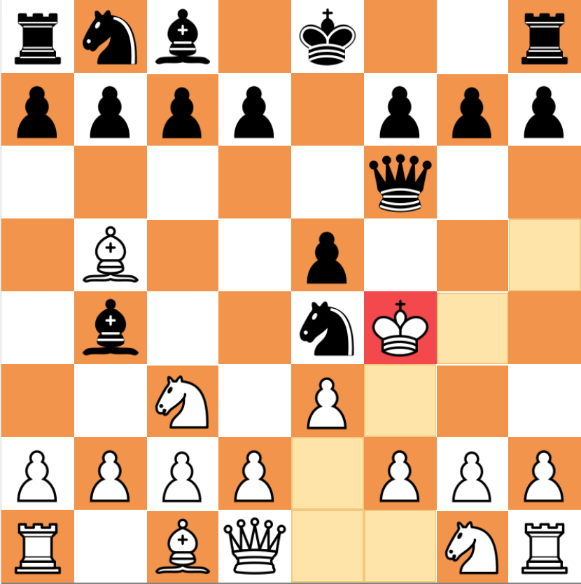
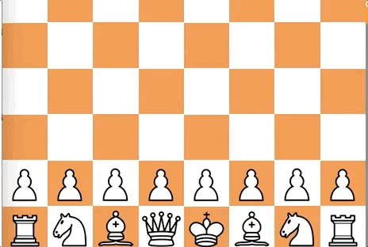
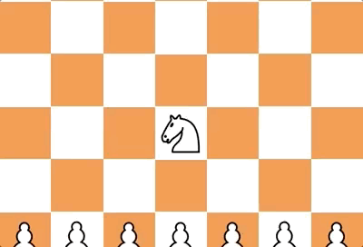
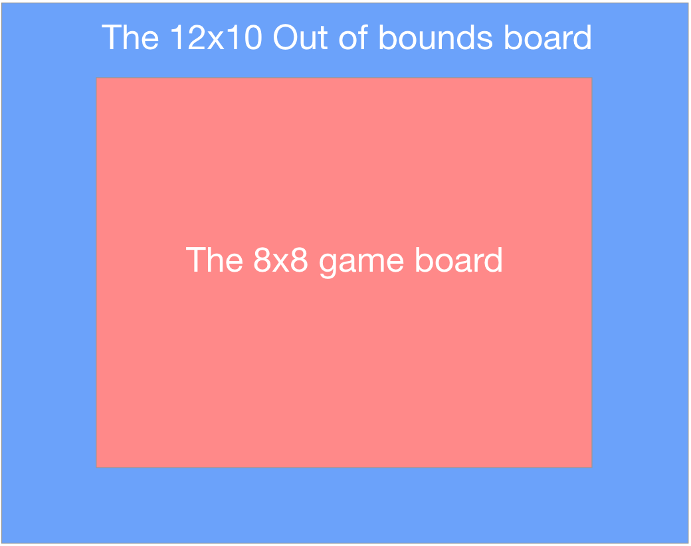

#Chess Battles

[Link to live App](http://ec2-52-15-238-17.us-east-2.compute.amazonaws.com/)


Main Functionality
---
Play a game of Chess with a twist! There are different classes in the game, where each class has it's own unique moves. We keep track of how well you're doing by recording your wins and losses.



User actions
---
* Signup
* Login
* Search for a game against another player

Classes
---
###Conqueror - King
* Has one extra move vertically, and horizontally
* The extra move is considered a hop, and lets the King jump over pieces like the Knight


###Knight - Knight
* The knight can now move in the tile between it's regular moveset


Pieces
---
Each piece is an object, where its valid moves are saved to an array that corresponds to the engine array.
```
export class Knight extends Piece {
    constructor(team, type) {
        super(team, type)
        this.team === 1 ? this.name = 'whiteKnight' : this.name = 'blackKnight'
    }
    findValidMoves() {
        if(this.type) {
            let boundsIndex = convertBounds(board[this.position].rankFile)
            let possibleMoves = [boundsIndex+21, boundsIndex+12, boundsIndex-8, boundsIndex-19, boundsIndex-21, boundsIndex-12, boundsIndex+8, boundsIndex+19, boundsIndex+20, boundsIndex-20, boundsIndex-2, boundsIndex+2 ]
            //Remove out of bounds
            possibleMoves = possibleMoves.map(int => {if(!isOffBoard(int)) return convertBoard(int)}).filter(int => int !== undefined)
            //Check for teamate/enemy
            possibleMoves = possibleMoves.map(int => {
                if(!board[int].piece) return int
                else if(!this.isSameTeam(board[int].piece.team)) return int
            }).filter(int => int !== undefined)

            return possibleMoves
        }else {
            let boundsIndex = convertBounds(board[this.position].rankFile)
            let possibleMoves = [boundsIndex+21, boundsIndex+12, boundsIndex-8, boundsIndex-19, boundsIndex-21, boundsIndex-12, boundsIndex+8, boundsIndex+19]
            //Remove out of bounds
            possibleMoves = possibleMoves.map(int => {if(!isOffBoard(int)) return convertBoard(int)}).filter(int => int !== undefined)
            //Check for teamate/enemy
            possibleMoves = possibleMoves.map(int => {
                if(!board[int].piece) return int
                else if(!this.isSameTeam(board[int].piece.team)) return int
            }).filter(int => int !== undefined)

            return possibleMoves
        }
    }
}
```

Chess Engine
---
The engine uses two arrays to position the pieces on the board and to detect moves considered out of bounds.

Board = array of length 64 (8x8)
OutOfBounds = array of length 120 (12x10)



We convert between the two arrays
```
//converts 64 index based array to 120 index based array
export function convertBounds(rankFile) {
    //rankFile is a string ex: '0,6' => board[6]
    //convert rankFile to an array of integers ex: '1,8' => [1,8]
    let parsed = rankFile.split(',').map(num => parseInt(num))
    let rank = parsed[0]
    let file = parsed[1]
    let boundsIndex = (21 + file) + (rank * 10)
    //return the index of 120 array
    return boundsIndex
}
//converts index from 120 array to 64 array
export function convertBoard(index){
    //index === boundsBoard[index]
    let val
    //convert depending on index inside boundsBoard
    if(index<31) {
        val = index-21
    }else if(index<41) {
        val = index-21-2
    }else if(index<51) {
        val = index-21-4
    }else if(index<61) {
        val = index-21-6
    }else if(index<71) {
        val = index-21-8
    }else if(index<81) {
        val = index-21-10
    }else if(index<91) {
        val = index-21-12
    }else if(index<101) {
        val  = index-21-14
    }
    //return the board index if not out of bounds
    if(!isOffBoard(index)) return val
    //return null if out of bounds
    else return null
}
```
Each tile is represented as so:
```
    //push 64 empty the tiles into the board
    for(let i = 0; i < 8; i++) {
        for(let j = 0; j < 8; j++) {
            let tile = {
                rankFile: `${i},${j}`,
                piece: null
            }
            board.push(tile)
        }
    }
```
